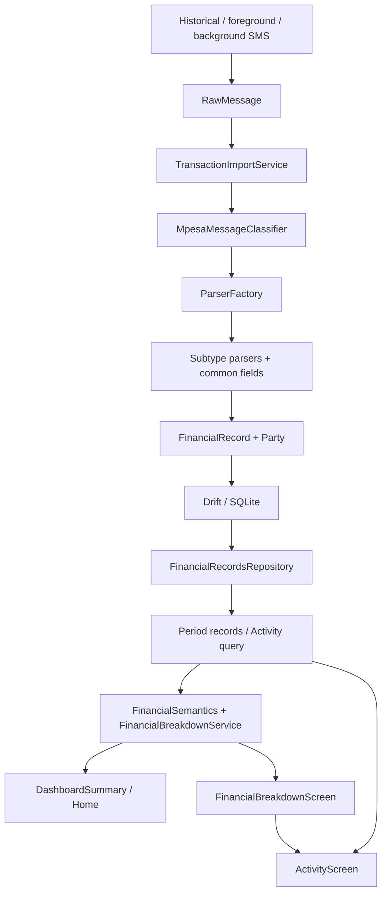

# InSlate project handover

**Snapshot:** 6 October 2026, Africa/Nairobi  
**Audience:** AI architect, project manager, and next implementation agent  
**Application:** Flutter project in `inslate/`  
**Current branch:** `feature/dashboard-screen`  
**Evidence:** current workspace implementation, tests, and decisions in the development conversation.

This is a handover of the working tree, not a claim that all changes are committed, merged, deployed, or validated on a physical device. The tree contains substantial modified and untracked architecture, screen, and test files. Latest inspected commit: `c33c06e`. Preserve the working tree; do not reset it or replace feature files with `main` versions. Existing documentation may describe earlier ExpTrail/InSlate plans; use this document and current code to assess implementation status.

## 1. Executive status

InSlate is moving from an SMS transaction viewer into a financial application driven by normalized financial records and explicit financial meaning. M-PESA is the currently observable central wallet. The read-side model allows typed periods, financial scopes, parties, account families, and transfer direction without introducing a new router or redesigning ingestion.

The current milestone delivers a period-aware Home dashboard, reusable financial breakdowns, and a canonical Activity explorer. It also adds M-Shwari loan ingestion using the existing generic loan subtypes. Insights and Profile/Your Data are still future milestones.

| Area | Current status | Important limit |
| --- | --- | --- |
| Historical SMS import | Implemented | Stored raw messages are skipped on subsequent imports, even if previously unsupported |
| Foreground/background SMS | Implemented | Android telephony and actual device permissions/lifecycle remain relevant |
| Resume reconciliation | Implemented | Uses latest raw-message time with a one-minute overlap |
| Duplicate handling | Implemented and tested | Do not assume a reference alone is a globally unique transaction key |
| Typed financial semantics | Implemented | Legacy summary formulas still exist separately |
| Period-aware data queries | Implemented | Party identity matching can scan candidates within the selected period |
| Home/Dashboard | Implemented and iteratively styled | Physical-device visual and performance sign-off is not recorded |
| Activity | Implemented | Offset pagination; no new routing package |
| Breakdown screens | Implemented | Account/instrument groups reflect observable transactions, not actual portfolio balances |
| M-Shwari borrowing | Implemented using a production SMS | Previously stored October 3 message still needs a targeted backfill |
| M-Shwari repayment/top-up | Conservative grammar implemented | Additional formats have synthetic tests, not independently confirmed production fixtures |
| Insights | Placeholder | No analytical screen or month-over-month service delivered yet |
| Profile/Your Data | Not implemented | Fourth shell destination is still More, a placeholder |

Latest validation after loan support: **67 focused tests passed; 136 full-suite tests passed; `flutter analyze` reported no issues; formatter completed; `git diff --check` passed.** These are automated results, not proof of Android background delivery or device performance.

The approximately 8,800-record history mentioned during development is user-reported context, not a current database statistic. Never display it as a hardcoded product metric.

## 2. Product decisions and guardrails

- Financial UI consumes normalized `FinancialRecord` data; SMS is an ingestion source, not the presentation model.
- Preserve historical import, live import, background handling, reconciliation, failed/unsupported handling, and duplicate protection.
- Do not rewrite parsers/classifier as part of unrelated UI work. The M-Shwari loan change is a deliberately narrow addition.
- Financial meaning belongs in domain/services/providers, not widget-specific arithmetic or string filters.
- Use existing enums, typed queries, and ordinary `Navigator` routes. No routing package was added.
- Keep changes incremental. A generic design system or a full Dashboard rewrite is not a prerequisite for remaining milestones.
- `main` was a visual reference for the previous Dashboard; it was not merged or copied over the feature file wholesale.
- Never preserve the wrong month's financial values under a newly selected month label merely to hide a spinner.
- Do not infer balances, loan debt, investment returns, unreported fees, unsupported data statistics, or AI conclusions.
- No new schema migration or dependency was needed for the financial read-side work or M-Shwari loan support.

## 3. Runtime and architecture map



### Application entry and shell

`lib/main.dart` creates a Riverpod `ProviderScope` and Material app using `AppTheme.light()`, starting at `StartupScreen`. Startup/onboarding use persisted onboarding and initial-import completion flags.

`lib/screens/app_shell.dart` owns Home, Activity, Insights, and More through an `IndexedStack`. Activity is initialized lazily on first selection and then retained. Insights/More are placeholders. Shell initialization starts incoming SMS listening and catch-up; app resume triggers catch-up again. Dashboard detail screens are pushed with `Navigator` and `MaterialPageRoute`.

The Dashboard header's Insights icon currently has an empty callback. Its visual presence is not evidence of a working Insights destination.

### Dependencies and environment

The project declares Dart SDK `^3.11.0`, app version `1.0.0+1`, Flutter Material, Riverpod `^2.6.1`, Drift `^2.29.0`, SQLite support, `another_telephony`, `permission_handler`, `intl`, shared preferences, path/path-provider, and existing branding/build tools. No package was introduced for these product milestones.

Current development is on Windows. SDK commands used in the session are `C:/flutter/flutter/bin/flutter.bat` and `C:/flutter/flutter/bin/dart.bat`. Read/write PowerShell text with UTF-8 explicitly. SDK cache access may require the environment's normal approval mechanism.

## 4. Data and ingestion

### Stored models

`FinancialRecord` stores reference, transaction date, received time, principal amount, optional balance, type/subtype/status, title, party, transaction cost, raw message, and source-message ID. The database flattens party fields for persistence. Money uses the existing double/SQLite real representation; this handover does not propose changing it without a separate reason and migration plan.

`RawMessage` preserves source ID, sender, body, and received time. `Party` can represent name, type, phone, account, and identifier. This identity feeds grouping and exact Activity filters.

`Accounts` and its DAO/model already exist. FinancialRecords database columns include nullable source/destination account IDs, but the current domain record/builder does not expose or populate actual linked account IDs. Current read-side endpoints are inferred account families plus available party identity. Do not describe this as a completed account ledger or invent known account counts from endpoint labels.

### Persistence

`AppDatabase` currently has schema version **4** and opens `InSlate.db` in the app documents directory using a lazy `NativeDatabase` connection. Existing migrations concern source-message/raw-message storage. The current product work did not increment the schema version. Generated Drift files remain part of the project; do not manually edit generated code.

### Import behavior

`TransactionImportService`:

1. Checks existing raw source IDs before classification.
2. Reconciles identical sender/body duplicates, including different SMS IDs.
3. Saves new raw messages before processing them.
4. Classifies and selects a parser through `ParserFactory`.
5. Skips failed transactions and unsupported classifications; records parsing failures separately.
6. Persists new financial records with source-message duplicate checks and reference/collision logging.
7. Processes batches of 2,000 and yields between batches.

Distinct SMS records can share a reference, for example related loan/payment activity. Existing tests protect that behavior. Do not replace it with unconditional deduplication by reference.

`smsSourceId` uses the inbox numeric ID when supplied. Broadcasts without it use the existing sender/time/body-hash fallback; sender/body deduplication handles later inbox reconciliation. This is the current implementation, not a claim of a cryptographic or permanently stable cross-runtime identifier.

`backgroundSmsHandler` checks sender/body, opens its own database/importer, and closes the connection afterward. Foreground listeners and resume catch-up use the same classifier/parser pipeline. The UI refresh revision is incremented after relevant foreground/import/catch-up work, including catch-up where a background isolate already saved the messages.

`ImportLogger` writes diagnostic text to `logs/import.log` under application documents. These logs include import/skipped/failure summaries and can include transaction details or raw-message collision content. Logs are not a structured, complete analytics/history table.

## 5. Financial meaning: authoritative current read-side contract

`FinancialSemantics` is the current financial policy used by the new Dashboard/breakdown/filtering path. A subtype with an inconsistent stored `FinancialRecordType` is unresolved rather than silently given the wrong meaning.

| Metric/class | Included subtypes | Formula/meaning |
| --- | --- | --- |
| Income / Received | `receiveMoney`, `deposit` with expected income type | Sum of principal amounts; these currently have identical membership |
| Expenses / Sent | `sendMoney`, `buyGoods`, `payBill`, `airtimePurchase`, `airtimeTopUp`, `withdrawal` with expected expense type | Sum of principal amounts; these currently have identical membership |
| Fees | All records supplied for the period | Sum of stored `transactionCost`, once |
| Net cash flow | Above totals | Income − Expenses − Fees |
| Borrowed | `fulizaLoan`, `loanDisbursement` with loan type | Sum of principal |
| Repaid | `fulizaRepayment`, `loanRepayment` with loan type | Sum of principal |
| From central wallet | `mshwariDeposit`, `kcbDeposit`, `investmentPurchase` with transfer type | Resolved movement from central wallet to the other endpoint |
| Into central wallet | `mshwariWithdrawal`, `kcbWithdrawal`, `investmentRedemption` with transfer type | Resolved movement from the other endpoint to central wallet |
| Internal transfers | Both resolved directions | Into + From; gross movement, not a balance or net change |
| Unresolved | Generic `savingsDeposit`, `savingsWithdrawal`, `billPayment`, `unknown`, or type/subtype mismatch | Visible where applicable; not invented into a resolved financial class |

The default central endpoint is M-PESA. `AccountEndpoint`, `AccountMovement`, and `TransferDirection` allow source/destination-family reasoning relative to a chosen endpoint. They are not yet evidence that every imported record has explicit linked owned accounts.

Internal transfer principal does not alter Income, Expenses, Received, Sent, or Net cash flow. Loan principal is excluded from those metrics too. Explicitly recorded fees still contribute to Fees and therefore Net cash flow. A missing fee amount is not reconstructed.

### Legacy compatibility path: do not mix formulas

`FinancialSummary`, `FinancialSummaryService`, `financialSummaryProvider`, and `financialRecordsProvider` remain. The legacy provider loads full history and filters a month in Dart. It is not the new Dashboard's data dependency.

The legacy summary adds principal **plus fees** to `totalExpenses` and `spendingBySubtype`; `totalSent` uses principal. Its `netMovement` is `totalReceived - totalSent`. A separate `financialTotals` property exposes the new contract. These are deliberately distinct; subtracting fees again from legacy expense totals would double-count them. Do not feed legacy fields into new Insights formulas.

Legacy summary calculates party/category/count/balance/recent metrics as well. Keep it for compatibility unless a separately scoped cleanup proves remaining consumers and tests are migrated. It must not silently become the source for new screens.

### Grouping

`FinancialBreakdownService` creates Dashboard summaries and typed breakdowns. Groups sort by descending principal amount with a label tie-break. Category shares use principal amounts, excluding fees. Party identity precedence is identifier, phone, account, then name, using the shared normalization policy. Unidentified parties remain separate and their child filter does not accidentally include identified parties.

Group totals reconcile to the Activity filter used to open them. Unresolved supplemental sections can be excluded from headline totals; the UI identifies that exclusion. Combined transfer/capital totals represent gross activity, not assets, performance, available funds, or debt.

## 6. Period queries, Activity, and performance

`FinancialPeriod` represents immutable date ranges with start-inclusive/end-exclusive boundaries. Effective transaction time is `transactionDate ?? receivedAt` in Dart and `COALESCE(transaction_date, received_at)` in SQL. Preserve this equivalence.

`ActivityFilter` is an immutable typed query covering period, scope, subtype, party, party presence, semantic resolution, direction, endpoint, and central endpoint. `matches` and SQL candidate filtering use the same financial policy.

`FinancialRecordsDao` supplies period candidates, date bounds, and distinct effective-month keys. It filters period and available typed scope/subtype/direction/account-family semantics in SQL and orders newest effective date first, then descending row ID for deterministic ties.

`FinancialRecordsRepository.getActivity` uses SQL pagination when possible. Identity-qualified party/account filters read period-filtered candidate batches of 100 and apply the shared Dart identity policy before result offset/limit. This avoids SQL/Dart identity normalization disagreement. It is bounded by period, but can still traverse many candidates or revisit earlier candidates on later offset pages.

`activityPageProvider` uses a page size of 50 plus one sentinel row to determine whether more data exists. Grouping into chronological days is in `activity_grouping.dart`. Activity loads the requested page/period; it does not start by loading full history. `TransactionRow` is reused by Activity and Dashboard Recent Activity.

`periodRecordsProvider` fetches the entire selected period for summary/breakdown calculations. `dashboardSummaryProvider` computes `DashboardSummary`; `financialBreakdownProvider` supplies query-specific breakdowns from the period data. The actual provider name is **`dashboardSummaryProvider`**, not a literal `dashboardProvider` symbol.

### What performance work is complete

- Home and month metadata no longer depend on loading complete history.
- Month availability/date range use metadata queries rather than materializing all records.
- Activity is lazy in the shell and paginated.
- Refreshes use a shared data revision for period/page/metadata dependencies.
- Financial aggregation/grouping moved out of widgets into services.

### What is not proven or optimized

- There is no physical-device profile proving the skipped-frame problem is completely resolved.
- Dashboard builds all `BreakdownKind` results from the period records; the service still makes multiple period-sized passes.
- SQL effective-date predicates use an expression; do not assume an efficient index plan without measurement. The inspected table declares a reference index, not a newly added period-expression index.
- The existing NativeDatabase connection and import logging deserve measurement before any isolate/index/logging rewrite.
- Party-filter offset pagination may be costly for large periods. Test actual use before changing it to cursors or denormalized identities.

## 7. Dashboard: completed behavior and final visual direction

The Dashboard is a summary/navigation surface. Current order:

1. Dark InSlate header, logo, Financial intelligence subtitle, Insights icon, and pinned month/year selector.
2. Money Movement: Received, Sent, internal movement Into M-PESA / From M-PESA.
3. Overview: Income, Expenses, Fees, Net cash flow.
4. Expense categories.
5. Income categories.
6. Top Expenses.
7. Top Income.
8. Loans.
9. Investments & Savings.
10. Recent Activity, only when the selected period is the current month.

Historical month transaction history is accessed through Activity. Recent Activity's absence in older months is intentional.

### Design decisions reached through user review

- Preserve the former `main` header/month selector visual language while consuming new period-aware data.
- Reduce unused space below the month strip.
- Card surfaces are white against the pale `#F4F7F8` page; card headings/icons are navy, with no navy-filled header bands.
- Income amounts/category progress use green; expense amounts/category progress use red.
- Top party previews have no rank numbering, wider names, right-aligned amounts, and compact View All buttons.
- Individual Top Income/Expense entries open their exact Activity filter directly. View All retains the full grouped-breakdown flow.
- Loan and capital card headers are not clickable duplicates of the button.
- Capital Dashboard actions form two paired rows with a single heading per row: **Investments: Purchases | Redemptions**, then **Savings: Deposits | Withdrawals**. Each action has its own filter/link, amount, count, and direction color. View savings & investments retains the combined route.
- Purchases/deposits are red for money from the central wallet; redemptions/withdrawals are green for money into it. These colors are not claims about investment profit or loss.

### Refresh/blink fix

The scroll view, pinned header, selector, and card structure remain mounted. Both AsyncValue skip-loading flags are true. Same-period refresh/reload retains usable data rather than replacing the page with a spinner. Initial loading without data may show a loading message. Errors are surfaced and can retry.

When the selected month changes while previous data is available, period mismatch is explicitly detected. `_DashboardPendingValues` replaces monetary values/counts with placeholders, maintained-size visibility hides old detailed rows, and `SliverIgnorePointer` disables stale interactions. This retains layout without falsely labelling prior-period values as the new month. No artificial delay was added.

Keep the period check and pending states if modifying providers or widgets. Merely setting skip-loading flags without checking period identity is insufficient.

## 8. Breakdown screens and navigation contract

`BreakdownKind` currently includes `spending`, `incomeCategories`, `expenseParties`, `incomeParties`, `internalMovement`, `loans`, `investmentsAndSavings`, `investmentPurchases`, `investmentRedemptions`, `savingsDeposits`, and `savingsWithdrawals`.

| Entry | Navigation |
| --- | --- |
| Expense/income category card header | Full category breakdown → party groups → Activity |
| Individual category preview | Party groups for that subtype → Activity |
| Individual top-party entry | Exact party Activity directly |
| Top-party View All | Party breakdown → Activity |
| Internal movement | Direction/account-family groups → Activity |
| Loan button | Borrowed/Repaid provider/subtype groups → Activity |
| Individual capital action | Matching purchase/redemption/deposit/withdrawal instrument groups → Activity |
| Capital View All | Combined Savings/Investments groups → Activity |
| Recent Activity View All | All Activity for the period |

Every push carries an immutable period/filter snapshot. Changing Dashboard selection afterward must not silently change the pushed screen's dataset.

`FinancialBreakdownScreen` supplies category/party layouts and a shared account-movement presentation for internal transfers, loans, and capital activity. It uses a navy app bar, white rounded cards, period/total/count/recorded-fee summary, empty/error/retry states, and the shared `FinancialGroupRow`.

Loan views clarify that borrowing/repayment activity is not an outstanding balance. Savings/investment views clarify that contributions/withdrawals do not establish account/portfolio value. Mixed-direction totals remain neutral; direction amounts use red/green. Capital group rows also have tinted backgrounds and direction arrows. Unresolved direction stays neutral.

`category_transactions_screen.dart` and `party_transactions_screen.dart` remain compatibility entry points adapted to the common typed breakdown flow. Do not create new almost-identical screens for each Dashboard card.

## 9. Latest ingestion addition: M-Shwari loans

Primary production fixture:

> UJ3NY8KRG4 Confirmed. Your M-Shwari loan has been approved on 3/10/26 12:42 AM and Ksh3,940.00 less excise duty has been deposited to your M-PESA account. New M-PESA balance is Ksh3,940.00. Did you know you can top up your M-Shwari loan once within the first 20 days?

### Implemented interpretation

- Subtype `loanDisbursement`, financial type `loan`, status `successful` representing confirmed.
- Principal KSh 3,940; recorded resulting M-PESA balance KSh 3,940.
- Transaction time 3 October 2026 at 00:42, not received-time fallback.
- Reference and raw/source-message linkage preserved.
- Provider `Party(name: 'M-Shwari', type: PartyType.self)`.
- Destination M-PESA is explicit in the matched SMS clause, retained in raw text. No new linked account fields were invented in the current domain model.
- The unspecified excise duty is not calculated or stored as a made-up fee. Existing explicit transaction-cost parsing remains available.
- Loans → Borrowed includes the record; all income/expense/external/internal-transfer/capital principal totals exclude it.

### Implementation and confidence boundaries

`mshwari_loan_patterns.dart` isolates anchored confirmed-reference/action/amount patterns. The classifier checks them before ordinary savings/generic payments and prevents unsupported loan clauses from falling into savings classification. `MshwariLoanParser` uses shared fields plus the loan-specific date grammar, allowing the production format without “at.” `ParserFactory` routes generic loan subtypes to that parser; Fuliza routing remains unchanged.

An explicit approved **loan top-up** using the same disbursement grammar is treated as borrowing. The footer “Did you know you can top up…” is marketing and neither changes classification nor generates another record. Other additional-loan wording is not established as supported.

Repayment support is deliberately conservative: a confirmed reference and stated amount “has been used to [fully/partially] pay your [outstanding] M-Shwari loan.” Explicit source wording can mention M-PESA or M-Shwari/savings; absent origin/date/balance fields are not fabricated. These repayment/top-up variations are synthetic regression fixtures. Obtain a real repayment SMS before expanding grammar or claiming broad provider format coverage.

### Historical October 3 recovery: pending

Ordinary re-import does **not** repair an already saved-but-unparsed RawMessage. Existing source-ID checks happen before classification, and identical-body protection also prevents changing the SMS ID as a workaround. A regression test documents this behavior.

The smallest proposed safe recovery is a targeted one-off backfill, not an importer rewrite:

1. Locate the persisted RawMessage corresponding to `UJ3NY8KRG4` and preserve its exact stored source ID/body/time.
2. Check FinancialRecords by both that source-message ID and reference. If something already exists, inspect it rather than blindly insert or overwrite it.
3. Classify and parse the existing raw object using the corrected classifier/factory.
4. Verify loan subtype, provider, principal, date, and reference; save only the missing normalized record through the repository with a transactional/idempotent guard.
5. Trigger the existing read-side refresh and verify October's Loans → Borrowed and provider Activity.

No device backfill or user-data mutation has been performed in this session. Do not delete raw history, clear the database, reset initial-import flags, or weaken global deduplication to recover one transaction.

## 10. Shared components and extension points

| File/model | Responsibility | Reuse rule |
| --- | --- | --- |
| `core/presentation/financial_presentation.dart` | Money/period/subtype/account presentation | Reuse labels/formatting; do not reimplement widget money conventions |
| `models/financial_period.dart` | Period boundaries | Pass snapshots to drill-downs |
| `models/activity_filter.dart` | Typed selection/query | Use domain scope/subtype/identity instead of strings |
| `services/financial_semantics.dart` | Meaning, account direction, totals, identity | Single current financial policy |
| `services/financial_breakdown_service.dart` | Grouping, ordering, shares, Dashboard summaries | Reuse for Insights and breakdown calculations |
| `models/financial_breakdown.dart` | Summary/group/section/query models | Keep normalized financial data independent of SMS wording |
| `widgets/transaction_row.dart` | Reusable transaction presentation | Do not create a separate row per screen |
| `widgets/financial_group_row.dart` | Group amount/count/share/link presentation | Preserve exact filter selection |
| `services/activity_grouping.dart` | Day grouping | Keep chronological logic outside widgets |
| Dashboard private card/pending components | Existing card layout and stable refresh | Extract further only for demonstrated reuse |

## 11. Proposed next milestones

These are recommendations for planning, **not already delivered features or commitments**. No implementation time estimates are justified by this handover.

### A. Stabilize the current milestone and close the historical loan gap

**Architect/developer:** inspect the working diff, confirm source-ID/backfill safeguards, add a narrowly scoped recovery action or maintenance path if authorized, and collect real repayment/top-up fixtures. Do not change financial memberships merely to make expected amounts appear.

**PM/user:** accept the latest paired-row Dashboard and breakdown visuals on the actual device. Verify October loan visibility after controlled recovery. Confirm remaining visual issues by screen rather than reopening the entire Dashboard design.

**Acceptance:** no stale-month values, all drill-down totals reconcile, M-Shwari/Fuliza remain separate providers, no duplicate record on repeated recovery, original SMS preserved, full regression checks remain green.

### B. Measure Android startup/import/period-switch performance

Use profile mode on a representative device and real-sized history. Measure startup/catch-up, cold and warm month switches, large-period party filtering, and import/logging overhead. Record timings/query plans/frame evidence before proposing indexes, background database execution, identity caching, or pagination changes. Avoid performance claims based only on widget tests.

### C. Implement factual Insights

Use period-aware records and the current semantics/breakdown service. Initial sections: spending, income, cash flow, internal transfers, loans, investments/savings. Add adjacent-period comparison in service/provider logic only where periods/data support a truthful comparison. An empty period must not automatically imply a complete month with zero activity.

Suggested scoped files: `screens/insights/insights_screen.dart`, an insight/comparison model and service if calculations exceed existing summaries, `providers/insights_provider.dart`, and a small shell change. Test totals against existing financial policy, partial/current-month comparisons, insufficient history, empty/error states, and drill-down period snapshots.

Do not fabricate recommendations, annualized returns, disposable income, debt balances, AI commentary, or portfolio value from transaction totals.

### D. Implement Profile / Your Data

Replace the More placeholder with Profile once its scope is agreed. Present understandable data coverage and permissions, with deeper breakdowns available where useful.

Potential reliable derivations: SQL record/raw-message counts, effective date bounds, stored distinct types/subtypes/party information, permission state, and data-source identifiers actually represented in storage. Build lightweight aggregate DAO/repository methods rather than loading all raw bodies/records into widgets.

Accounts represented by typed transfer families are **recognized account families**, not necessarily populated Accounts rows. Do not equate them. Shared preferences currently persist onboarding/initial-import completion booleans, not a reliable last-sync timestamp. Import counters are per-run results/logs, not a durable categorized ledger of skipped/unsupported history. Label limitations or add justified persistence before displaying lifetime import statistics.

State that information is produced from locally stored SMS-derived records; do not claim encryption, complete device coverage, secure backups, or permission-revocation data deletion without implementation evidence.

### E. Later multi-source/account work, driven by actual requirements

Extend the existing source interface/classifier/parser boundary when a real second source is available. Decide actual owned-account linking/central-account selection only when needed. Retain subtype-as-action and provider-as-identity separation. M-Shwari borrowing must not introduce a provider-specific subtype precedent.

## 12. Open decisions and known limits

| Item | Decision/action required | Current truth |
| --- | --- | --- |
| Existing M-Shwari historical message | Choose a narrow recovery entry point | Not automatically retried; no backfill performed |
| Repayment/top-up format coverage | Obtain genuine additional SMS fixtures | Conservative synthetic grammars only beyond supplied borrowing message |
| Insights scope | Agree first comparisons and coverage language | Placeholder currently |
| Profile naming/navigation | Confirm replacement of More with Profile | More still placeholder |
| Data completeness | Define truthful coverage rules for insights | Earliest/latest record alone does not prove complete import |
| Active sources/accounts | Define stored vs recognized terminology | No completed populated owned-account graph |
| Last sync/import metrics | Decide whether durable metadata is needed | Current flags/logs do not provide a reliable structured lifetime history |
| Background delivery/performance | Physical-device profile and lifecycle test | Automated tests do not establish production reliability on every device |
| Legacy summary cleanup | Audit consumers in a separate task | Old fee-inclusive formulas/full-history provider remain |
| Commit/release status | Review and checkpoint the worktree | Significant current work is uncommitted/untracked |

No known failing automated test remains at this snapshot. This is not a claim that the product has no remaining limitations.

## 13. Validation and regression checklist

From `inslate/`:

```powershell
C:/flutter/flutter/bin/dart.bat format <changed-Dart-files>
C:/flutter/flutter/bin/flutter.bat test test/classifiers test/parsers test/services/financial_semantics_test.dart test/services/financial_breakdown_service_test.dart test/services/transaction_import_service_test.dart
C:/flutter/flutter/bin/flutter.bat test test/screens/dashboard_screen_test.dart
C:/flutter/flutter/bin/flutter.bat test
C:/flutter/flutter/bin/flutter.bat analyze
git diff --check
```

The `<changed-Dart-files>` token is a placeholder to replace, not a literal PowerShell argument. On other platforms use the local Flutter/Dart commands. `git diff --check` currently passes with line-ending warnings on some existing files; those warnings are not failed checks.

Tests cover classifier fixture precedence, parsers, loan semantics, period/filter SQL behavior, party identity/pagination, duplicate import, raw storage, lazy shell Activity, refresh/page retention, wrong-month protection, all major Dashboard drill-downs, paired capital-row geometry, and narrow/enlarged-text layouts. The M-Shwari fixture is in `test/fixtures/mshwari_loan_messages.dart`; end-to-end parsing/financial exclusions are in `test/parsers/mshwari_loan_parser_test.dart`; SQLite ingestion and stored-unparsed skipping are in `test/services/transaction_import_service_test.dart`.

Manual checks still recommended: actual device month/year switches, loan/capital/category navigation, empty older months, permission state, foreground/background/resume SMS delivery, full-history import, persisted loan visibility after app restart, and the targeted historical recovery. Record results separately from automated validation.

## 14. Fast onboarding for the next agent

1. Read this document, then inspect `git status` and preserve every pre-existing working change.
2. Read `financial_semantics.dart`, `activity_filter.dart`, `financial_breakdown_service.dart`, and the Dashboard/Activity providers before adding calculations or queries.
3. Read the relevant existing screen and its tests before changing visuals or navigation.
4. For ingestion work, inspect the precise pattern/parser and import duplicate behavior; require a fixture and avoid touching unrelated subtypes.
5. Pick one next milestone and state its acceptance criteria. Keep proposals separate from delivered behavior.
6. Run checks appropriate to changed behavior and the full suite for ingestion/semantic changes. Do not weaken tests to hide semantic regressions.
7. Update this handover when actual milestones, decisions, schema, or validation status change.

The immediate project position is: **financial-domain read architecture, Home, Activity, shared breakdowns, and narrowly scoped M-Shwari loans are implemented; device backfill/sign-off, measured performance, Insights, and Profile/Your Data remain the next work.**
